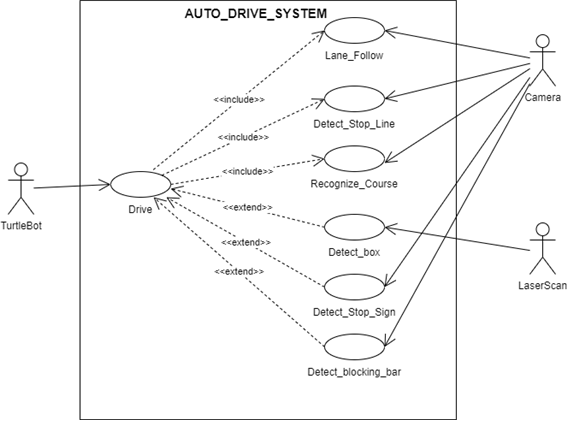
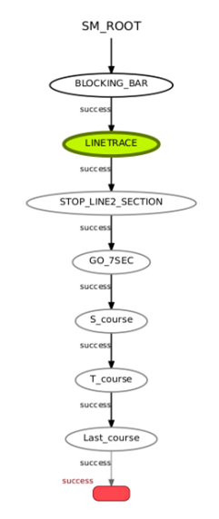
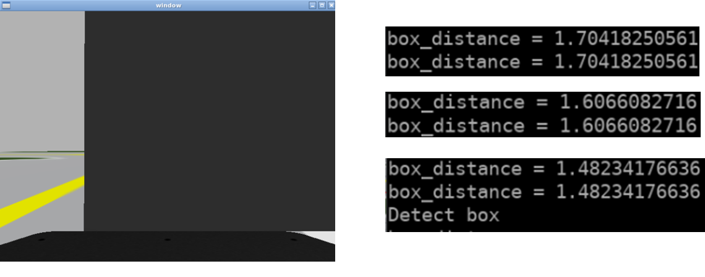
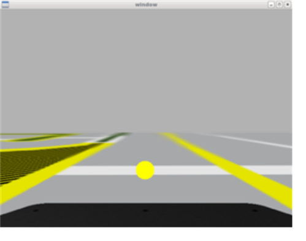
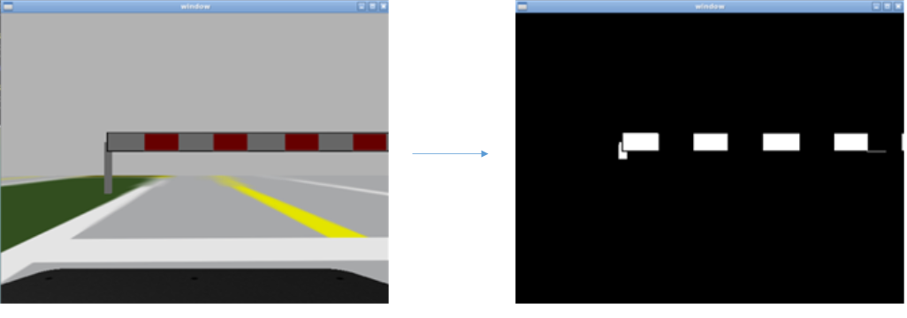

# Ros_Auto_Driving
Camera, 센서 데이터 처리를 활용한 주행시험장 내 자율 주행 로봇 구현

## 개요
주어진 주행시험장 환경에서 자율 주행 가능한 로봇 구현

## 요구 사항
- 터틀봇은 차단바를 인식하여 차단바가 올라가면 부딪히지 않고 출발한다.
- 터틀봇은 양쪽 차선을 인식하여 차선의 중앙에서 주행한다.
- 터틀봇은 정지선을 인식하고 3초간 정지한 후 출발한다.
- 터틀봇은 정지표지판을 인식하여 정지한 후 출발한다.
- 터틀봇은 움직이는 장애물을 인식하여 부딪히지 않고 주행해야 한다.
- 터틀봇은 정해진 코스로 주행해야 한다.
- 터틀봇의 속도는 1m/sec를 초과하면 안된다.

## 기능 목록
- 카메라를 이용한 영상 입출력 기능
- 입력된 영상을 처리 가능한 형태으로 변환
- 양 쪽 차선 인식을 통한 주행
- 사물 인식시 해당 사물에 대응하는 상태로 전이 후 동작 수행 (SMACH 사용)

## 개발 환경
```
* OS : Ubuntu 18.04 LTS
* Programming Language : Python2.7
* IDE : Pycharm 2.7.17
* Framework : Ros melodic
```

## UML
### Usecase


### State Machine Diagram


### 차선 인식


### 장애물 인식


### 정지선 인식


### 차단바 인식

